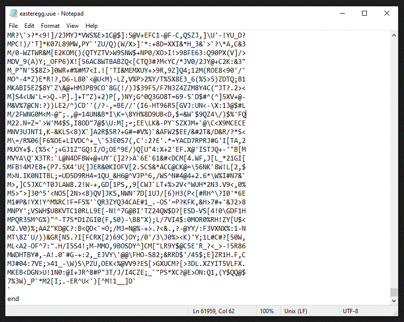

**Welcome to KopperKnight's Github Website**

### About Me

I am an aspiring open source software contributer who recently graduated from Minnesota State University, Mankato with
a bachelor's degree in computer engineering. I have experience programming in C, C++ and Java. However, I have the most experience with
Java as I first learned it way back in 2007. Below is a list of the projects I am currently doing or have done (will be uploading more coding projects
I have done in the past soon).

***
### Unix-to-Unix Encoder/Decoder / March 3, 2021

This is the source files to a uuencoder and uudecoder .cpp files that I originally submitted for 
my Fall 2019 computer science networking course on November 1, 2019. The project is [here.](https://github.com/KopperKnight/uue2019)



You can compile the project into executable files typing "make" on the commandline in linux or windows in the root directory of the sources.

- If you are on windows you need to install [mingw-w64](http://mingw-w64.org/) and add <mingw-location>\bin to your system PATH variable first. 
- if you are on linux you should have the C/C++ build tools already installed, otherwise on ubuntu specifically, you can install make/c/c++ compilers using the command 
```
sudo apt-get update
sudo apt-get install build-essential
```

- Additional, [Here](https://en.wikipedia.org/wiki/Uuencoding) is the wikipedia article on UUE format.

***

### Kopper Knight Tetris / February 17, 2021

A Tetris remake I put together one week in February 2021, using no third party libraries, in the Java Programming Language. 


  


You can see the current API Javadoc [here](kopperknighttetris/index.html). If you have Java 11 installed on your desktop you can download the cross platform version. If you have a Windows Desktop and do not have Java 11 installed or are not sure. you can download the windows version. 


- [cross-platform-version](https://github.com/KopperKnight/KopperKnightTetris/releases/tag/0.212jar) 
- [Windows Version](https://github.com/KopperKnight/KopperKnightTetris/releases/tag/0.212win)

***

<!---This is a work in progress for now. As my projects progress I will post them here.-->

<!---In the meantime the default template filler will exist below this line. -->
<!---____________________-->

<!---Test link. Click [HERE](myhtmlpage.html)-->

<!---You can use the [editor on GitHub](https://github.com/KopperKnight/kopperknight.github.io/edit/main/index.md) to maintain and preview the content for your website in Markdown files.-->

<!---Whenever you commit to this repository, GitHub Pages will run [Jekyll](https://jekyllrb.com/) to rebuild the pages in your site, from the content in your Markdown files.-->

<!---### Markdown-->

<!---Markdown **is a lightweight** and easy-to-use syntax for styling your writing. It includes conventions for-->

<!---```markdown-->
<!---Syntax highlighted code block-->

<!---# Header 1-->
<!---## Header 2-->
<!---### Header 3-->

<!---- Bulleted-->
<!---- List-->

<!---1. Numbered-->
<!---2. List-->

<!---**Bold** and _Italic_ and `Code` text-->

<!---[Link](url) and -->
<!---```-->

<!---For more details see [GitHub Flavored Markdown](https://guides.github.com/features/mastering-markdown/). -->

<!---### Jekyll Themes-->

<!---Your Pages site will use the layout and styles from the Jekyll theme you have selected in your [repository settings](https://github.com/KopperKnight/kopperknight.github.io/settings). The name of this theme is saved in the Jekyll `_config.yml` configuration file.-->

<!---### Support or Contact -->

<!---Having trouble with Pages? Check out our [documentation](https://docs.github.com/categories/github-pages-basics/) or [contact support](https://support.github.com/contact) and we’ll help you sort it out. -->
